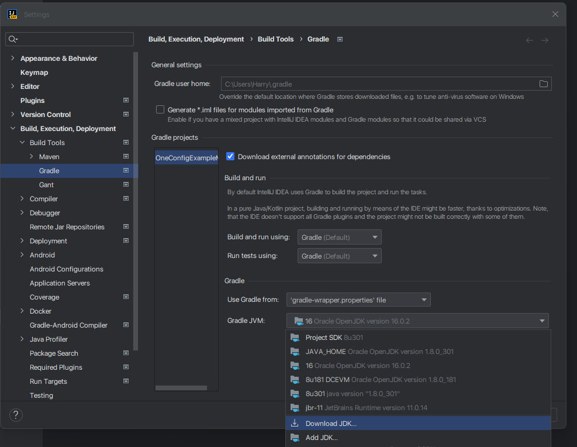

# Project Setup

## Step 3: Setting up JDKs

Now, you need to setup your JDKs (Java Development Kits) to get started with the coding. These are used to actually run your code and Minecraft, and build your projects.

### _1. Gradle JVM_

Firstly, hit **Ctrl+Alt+S** to open Settings, and select on the side: **Build, Execution and Deployment** **> Build Tools > Gradle**. At the bottom of this screen, there will be a dropdown box entitled **Gradle JVM** and click to open that.&#x20;

Now, click **Download JDK** and set the **Version to 16 or 17** on the popup that appears. Don't change anything else, just hit **Download**. Once that has finished, set that new JVM as the **Gradle JVM** and click **Apply** to set the changes.

### _2. Project JDK_

Next, Press **Ctrl+Alt+Shift+S** to open Project Settings, then go to **SDK under Project Settings > Project**.&#x20;

.png>)

Again go to **Add SDK and then Download SDK**. This time choose **1.8 as the version**, and press **Download**. Once that has finished, set that new JVM as the **Project SDK** and click **Apply** to set the changes.

&#x20;

In case you weren't sure, here are some pictures of example download dialogues.

.png>) .png>)

## Step 4: Reloading and building

Now you have your JDKs setup, you can go ahead close those windows and go back to the main IDE. Click the little green hammer in the top right of your screen, and wait for it to download all the necessary libraries, and Minecraft itself. Once thats done, you need to run `setupGradle` to decompile and load Minecraft properly. The easiest way to do this is to just **Hit control 3 times**, and type `gradle setupGradle` to decompile and get Minecraft ready to run.

Next, **hit control 3 times again**, and type `gradle genintellijruns` and run that as well to generate the run scripts for Minecraft. _Note: you might need to restart IntelliJ for the run to show up._&#x20;

## Step 5: Run!

**You are now ready to run your mod for the first time!** Make sure that the **Minecraft Client** is selected, and click the play button! With some luck, your game should launch! Now, press next below to continue with the tutorial and do some actual coding!


If you suffer any issues, make sure to go to [https://polyfrost.cc/discord](https://polyfrost.cc/discord) and ask!

